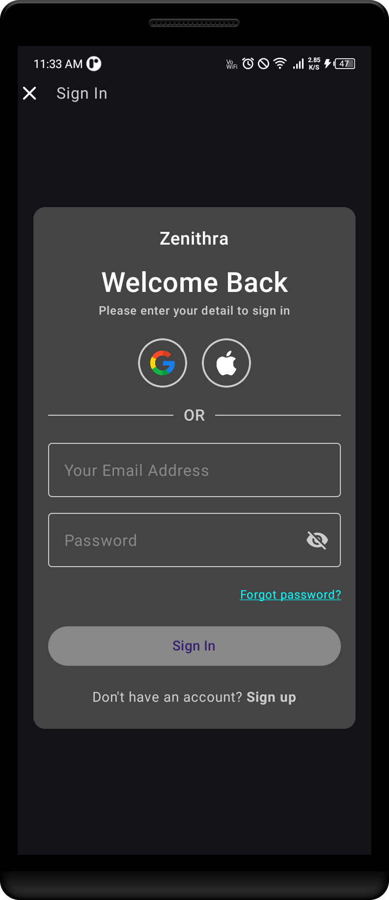
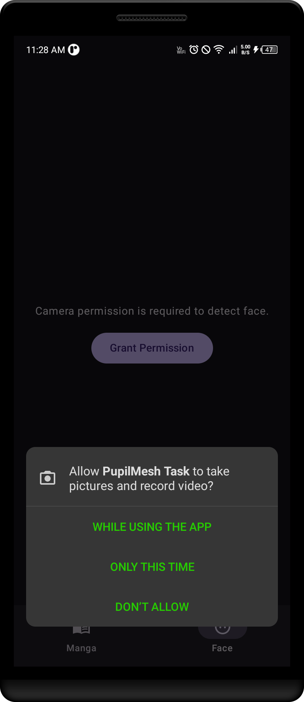
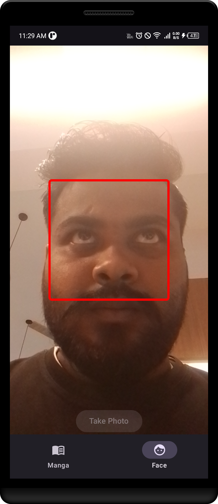
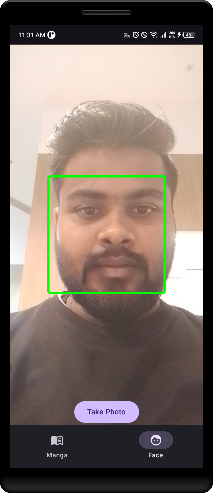

# 🛍️ PupilMesh Task - Android App (Jetpack Compose + MediaPipe)

This project is a part of the **PupilMesh Task**, implementing Login, Manga Fetch with Caching, Pagination, and Face Detection using MediaPipe.

---

## 📱 App Screens

  
  
  
  
  
  

  <video src="assets/pupilmesh_task.mp4" width="300" controls />

---
### 📱 Download APK
👉 [Download Latest APK (arm64-v8a)](https://github.com/Sandeepsahu1411/pupilMesh-Task/raw/main/releases/app-arm64-v8a-debug.apk)

## 🧠 Features

- Login & Registration with local Room DB + DataStore
- Manga Listing via API with Pagination & Caching
- Manga Detail Screen
- Face Detection using CameraX + MediaPipe
- Reference Box Detection (Green if face inside, Red if outside)
- Clean MVVM + Hilt + Paging3 + Navigation

---

